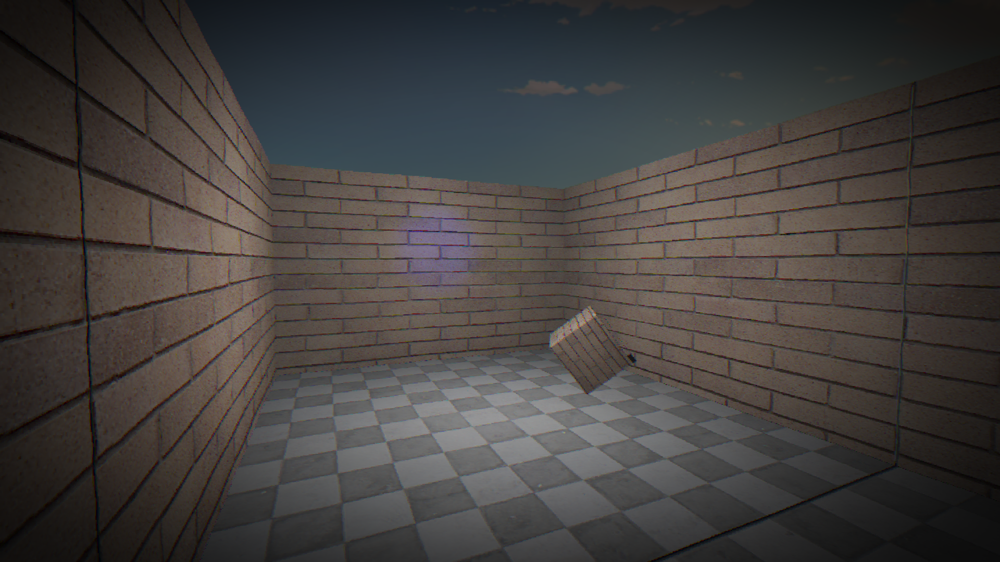
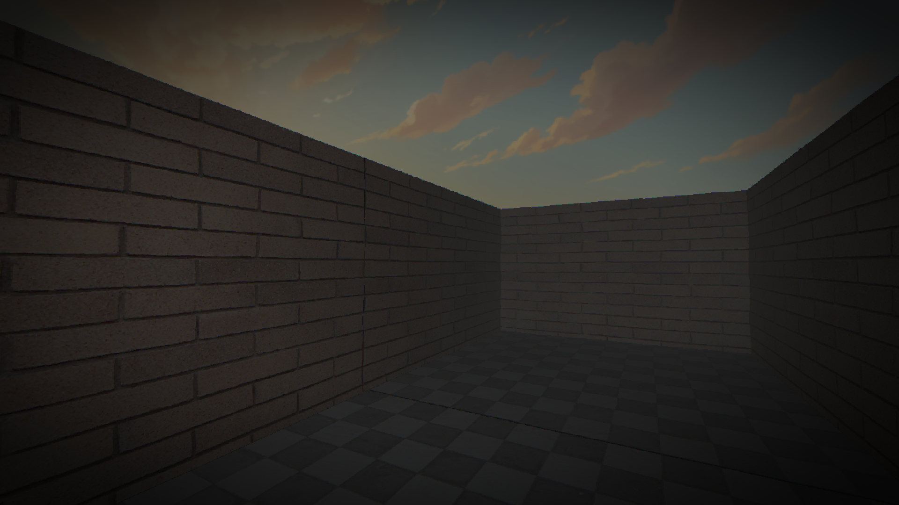
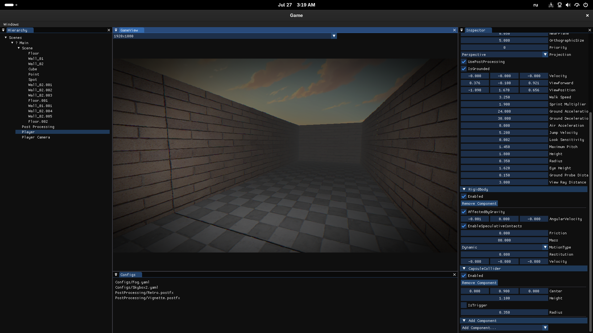

# Vecxy

Vecxy is a C# game engine focused on fast iteration, clear runtime APIs, and a built-in editor workflow that stays close to the game itself.

It is designed for building real playable scenes early, then growing into more advanced engine systems without forcing heavy tooling or complex project setup from day one.

## What it currently offers

- Scene-based workflow with hierarchical objects and components
- OpenGL renderer with materials, meshes, models, skybox, and runtime-editable lights
- Post-processing pipeline with configurable effects
- Hot reload for assets and configs
- Integrated editor overlay with hierarchy, inspector, configs, and game view
- Input, physics, gizmos, and first-person gameplay foundation

## Why Vecxy

Vecxy aims to sit in a practical middle ground:

- higher-level than raw framework code
- lighter and easier to reshape than a large off-the-shelf engine
- built for experimenting directly inside the running game

That makes it a good fit for prototypes, stylized first-person projects, horror scenes, and engine-first experimentation where iteration speed matters.

## Current direction

The engine is actively evolving around a few core ideas:

- runtime-friendly APIs instead of editor-only abstractions
- data-driven configuration through YAML
- hot reload as a default workflow
- integrated tooling that can be removed when shipping

## Status

Vecxy is in active development! The focus right now is on strengthening the runtime loop: rendering, scene authoring, lighting, post-processing, physics/gameplay interactions, and embedded editor tools.
